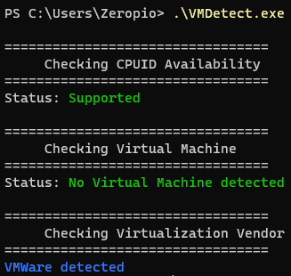

# VMDetect

## Overview
This Command Line Interface (CLI) application checks various system parameters to determine the presence of virtualization and provides information about the virtualization vendor. It utilizes CPUID and other system-specific checks to achieve this.

## Features
- Checks CPUID availability.
- Detects the presence of a Virtual Machine.
- Identifies the virtualization vendor (VMWare, VirtualBox, QEMU, WSL, or unknown).

## Prerequisites
This application is designed to run on systems with CPUID support. Ensure that the application is executed with appropriate permissions for accurate results.

## Usage
- Clone the repository:
```
git clone https://github.com/zeropio/VMDetect
cd VMDetect
make
```

- Run the application:
```
./VMDetect.exe
```



## Support
Currently, this project only supports the Windows OS.

## Contributing
Contributions are welcome! Feel free to open issues or submit pull requests.

## License
This project is licensed under the GPL 3.0 License - see the LICENSE file for details.